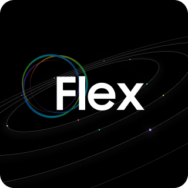
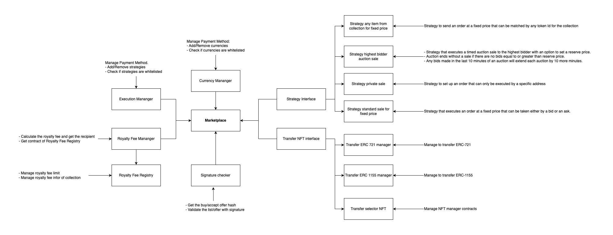
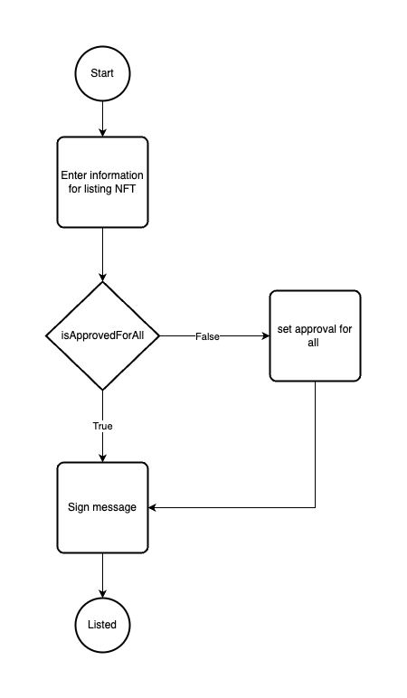
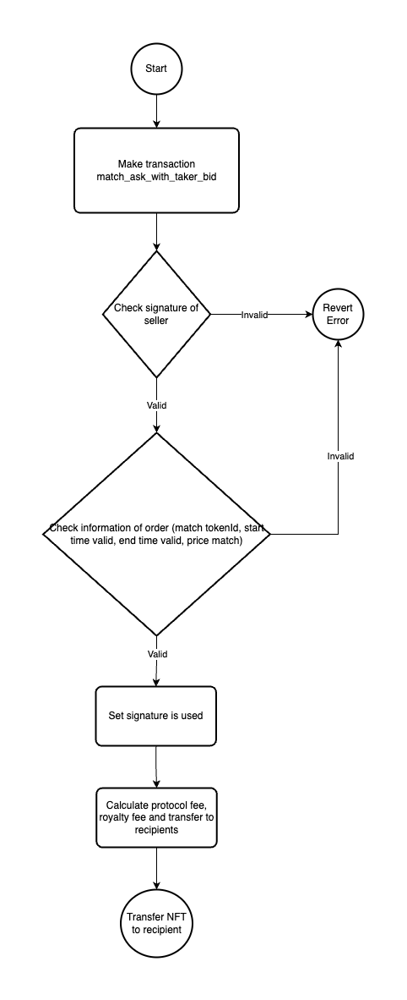
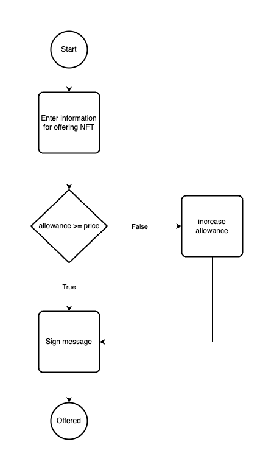
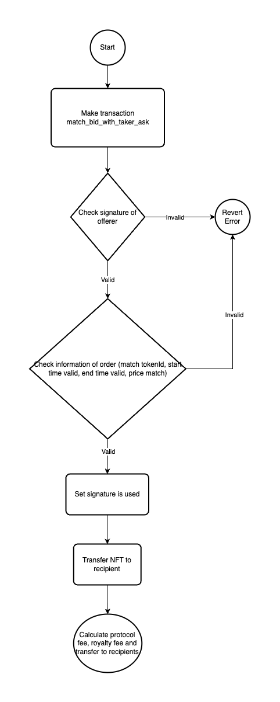

# Flex Contracts Monorepo

## Repository Structure

The repository is organized into the following directories:

1. `stakingpool`: Includes implementation of the staking NFT pool contracts.
#### Overview
The `StakingPool` contract allows users to stake their NFTs (ERC721 tokens) from specified eligible collections and earn rewards over time. This mechanism is designed to incentivize NFT holders by rewarding them based on the duration their NFTs remain staked.

#### Key Features

- **NFT Staking:** Users can stake their NFTs from collections that are approved by the contract owner.
- **Reward Accumulation:** Rewards are earned based on the amount of time an NFT is staked. The longer an NFT is staked, the more rewards it accrues.
- **Flexibility:** The contract supports various NFT collections, each with customizable reward parameters set by the contract owner.

#### Staking Process

 **Stake an NFT:**
   - Users call the `stakeNFT` function, providing the collection address and the token ID of the NFT they wish to stake.
   - Once staked, the NFT is locked in the contract and cannot be transferred until it is unstaked.

 **Unstake an NFT:**
   - Users can call the `unstakeNFT` function to retrieve their staked NFT.
   - During the unstaking process, any accumulated rewards are claimed and credited to the user.

 **Claiming Rewards:**
   - Rewards are calculated based on the staking duration and the reward rate set for the NFT collection.
   - Users can view their accumulated rewards for each staked NFT using the `getUserPointByItem` function.

#### Contract Configuration

- **Eligible Collections:** Only NFTs from collections that have been approved by the contract owner can be staked.
- **Reward Calculation:** The contract owner sets the time unit (in seconds) and the reward per unit time for each collection. These parameters determine how rewards accumulate for staked NFTs.

#### Security Considerations

- The contract implements reentrancy protection to secure staking and unstaking operations.
- Only the contract owner has the authority to modify which NFT collections are eligible for staking and to set the reward parameters.

2. `openedition`: Includes implementation of open-editions NFT minting mechanism contracts.
3. `marketplace`: Includes implementation of the marketplace contracts.

#### Development Setup

You will need to have Scarb and Starknet Foundry installed on your system. Refer to the documentations below:

-   [Starknet Foundry](https://foundry-rs.github.io/starknet-foundry/index.html)
-   [Scarb](https://docs.swmansion.com/scarb/download.html)

To use this repository, first clone it:

```
git clone git@github.com:Flex-NFT-Marketplace/Flex-Marketplace-Contract.git
```

### Building contracts

To build the contracts, run the command:

```
scarb build
```

Note: Use scarb version `2.6.3`.

### Running Tests

To run the tests contained within the `tests` folder, run the command:

```
scarb test
```

### Marketplace Contracts

#### Overview


#### Listing


#### Buy


#### Make Offer


#### Accept Offer
